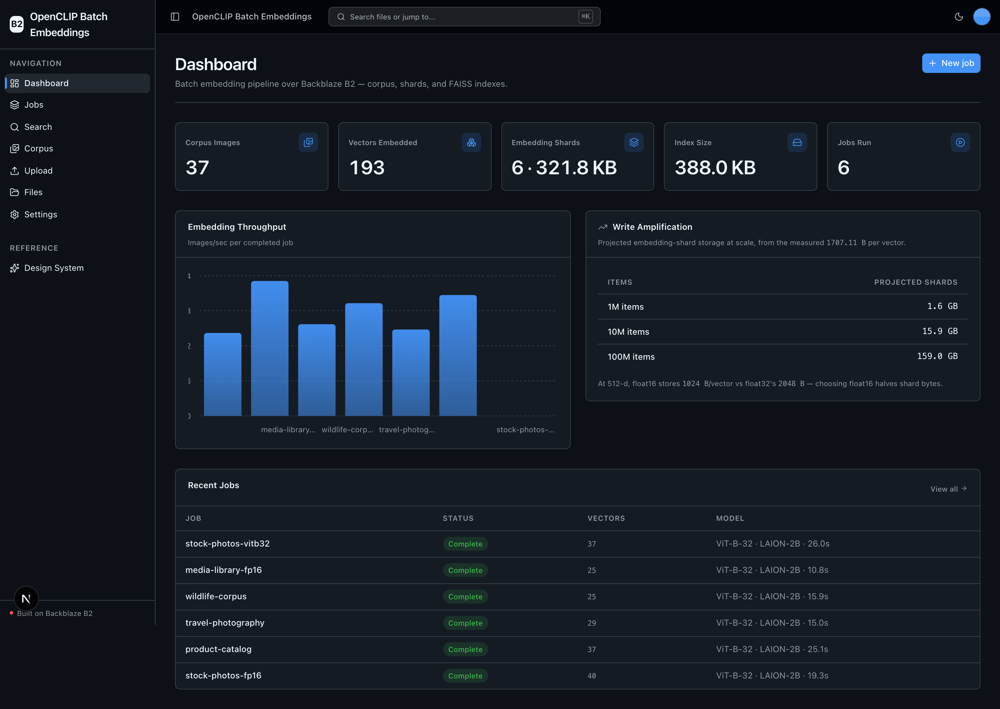
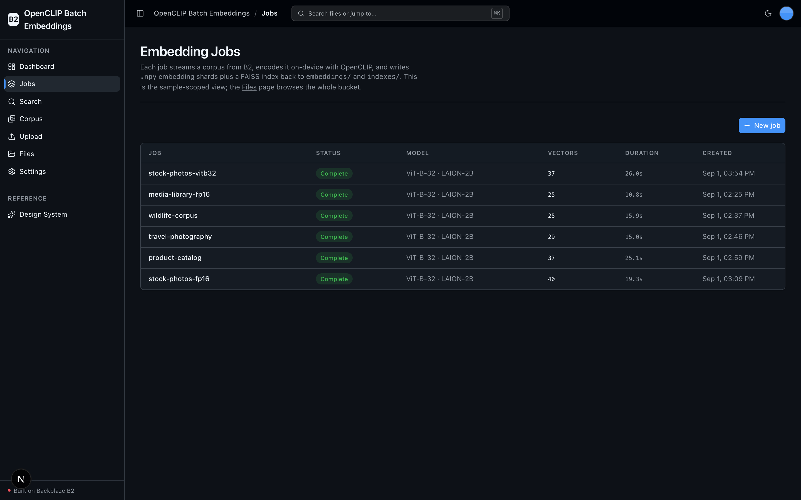
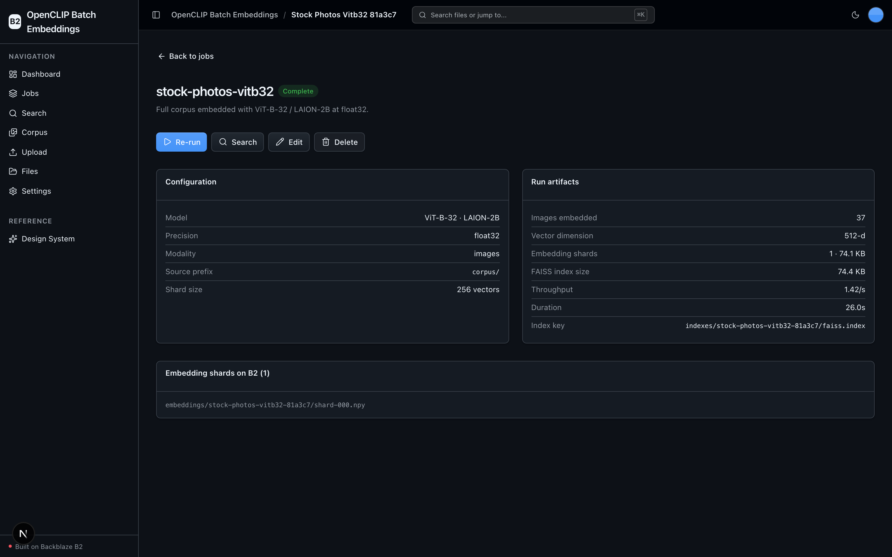
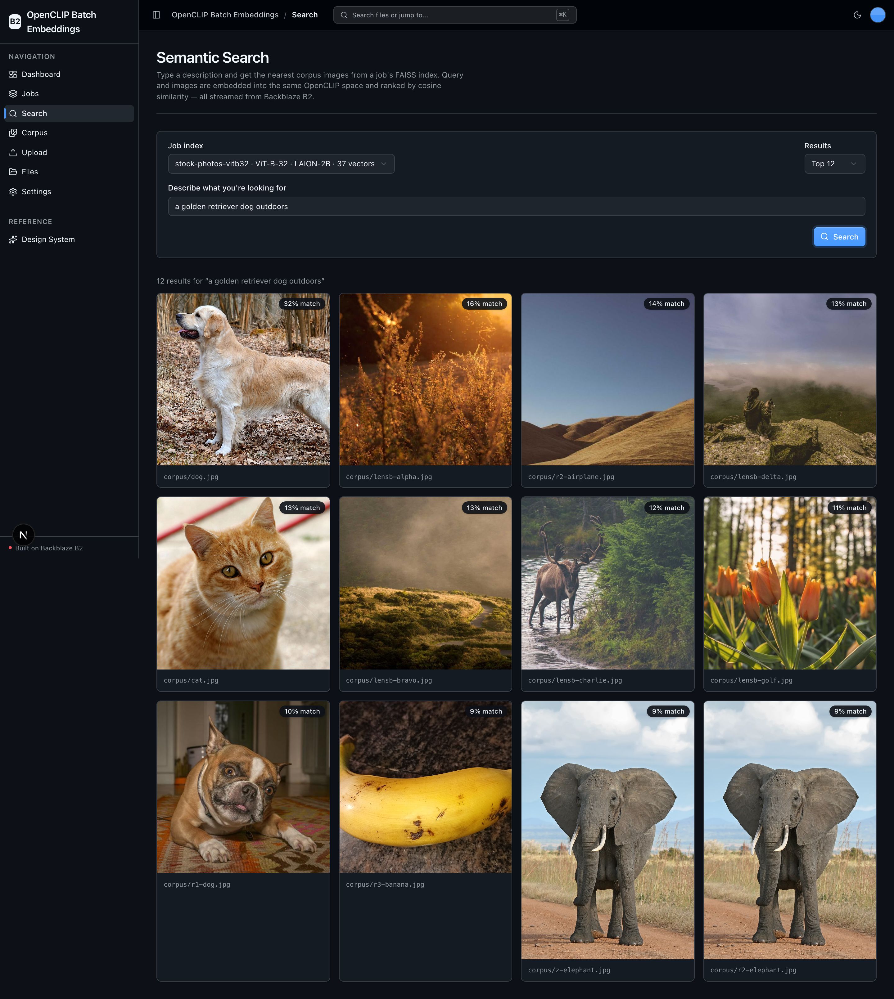
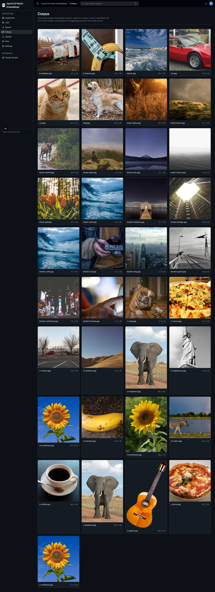

# OpenCLIP Batch Embeddings

Batch-embed large image corpora into a shared vector space and store **every
layer on [Backblaze B2](https://www.backblaze.com/sign-up/ai-cloud-storage?utm_source=github&utm_medium=referral&utm_campaign=ai_artifacts&utm_content=b2ai-openclip-batch-embeddings)** — the source images, the derived `.npy` embedding shards, and the
FAISS vector index — all over the S3-compatible API. Inference is 100% local
[OpenCLIP](https://github.com/mlfoundations/open_clip): **no external API key,
B2 credentials only**, CPU by default with CUDA → Apple MPS → CPU autodetect.

You create an **Embedding Job** (pick a source prefix + an OpenCLIP model +
precision), **run** it (stream images from B2 → encode locally → write float32/
float16 shards to `embeddings/<job>/` → build a FAISS index → upload it to
`indexes/<job>/`), then **search** it from a text query on the Semantic Search
page. It runs at demo scale (dozens of synthetic images) while the dashboard
makes the production write-amplification story concrete.

**What you get:**
- **Embedding jobs** — the primary entity: create / read / edit / delete / **run** batch runs with per-job model + precision config.
- **Batch CLIP pipeline** — stream images from B2, encode on-device, write `.npy` shards back to `embeddings/`.
- **Vector index build & share** — a FAISS index per job, uploaded to `indexes/` for reuse across workers.
- **Semantic search** — text query → top-k nearest images, streamed from B2.
- **Corpus library** — a scoped gallery of the source images the pipeline embeds.
- **Full-bucket file browser + upload** — the reusable B2-backed scaffolding (`/files`, `/upload`).
- Local, GPU-optional OpenCLIP inference — CPU by default; auto-detects CUDA → MPS → CPU.

## What it looks like

**Dashboard** — corpus, vector, shard, and index metrics, a write-amplification projection at scale, an embedding-throughput chart, and recent jobs.



**Jobs** — every embedding job with its model, precision, vector count, and run duration.



**Job detail** — one job's configuration alongside the run artifacts it wrote to B2: the `.npy` shards and the FAISS index key.



**Semantic search** — a text query embedded into the same OpenCLIP space and ranked against a job's FAISS index, with every image streamed from B2.



**Corpus** — the source images the pipeline embeds, under the `corpus/` prefix in B2.



## Quick Start

You need: Node.js >= 20, pnpm >= 9, Python >= 3.12, and a free
**[Backblaze B2 account](https://www.backblaze.com/sign-up/ai-cloud-storage?utm_source=github&utm_medium=referral&utm_campaign=ai_artifacts&utm_content=b2ai-openclip-batch-embeddings)**.
No AI provider key is required — embedding runs entirely on-device.

**1. Install**

```bash
git clone https://github.com/backblaze-b2-samples/openclip-batch-embeddings.git
cd openclip-batch-embeddings
pnpm run setup
```

`pnpm run setup` copies `.env.example` → `.env` (only if missing), installs
workspace dependencies, creates `services/api/.venv`, and installs the committed
Python 3.12 resolution from `services/api/requirements.lock` — including the
on-device ML stack (torch, torchvision, open_clip_torch, faiss-cpu).

> Use the `pnpm run` form: `setup` (like `doctor`) is a built-in pnpm command
> before pnpm 11, so bare `pnpm setup` would run pnpm's own command instead.

**2. Add your B2 credentials**

Open `.env` and fill in, from the
[Backblaze B2 dashboard](https://secure.backblaze.com/b2_buckets.htm?utm_source=github&utm_medium=referral&utm_campaign=ai_artifacts&utm_content=b2ai-openclip-batch-embeddings):

- Create a bucket → `B2_BUCKET_NAME`, and its region (e.g. `us-west-004`) → `B2_REGION`.
- Create an application key with `Read and Write` → `B2_APPLICATION_KEY_ID` and `B2_APPLICATION_KEY` *(shown once)*.

The S3 endpoint is derived from `B2_REGION` (`https://s3.<region>.backblazeb2.com`) —
no region is hardcoded in source. See [creating a bucket](https://www.backblaze.com/docs/cloud-storage-create-and-manage-buckets)
and [app keys](https://www.backblaze.com/docs/cloud-storage-create-and-manage-app-keys).

**3. Seed a demo corpus (optional but recommended)**

```bash
python scripts/seed-corpus.py
```

This generates a small **synthetic**, labeled image set with Pillow (no network,
no committed binaries, reproducible), uploads it to `corpus/`, and runs one demo
job end-to-end so the dashboard, search, and corpus pages have real artifacts.
**The first embed downloads ~600 MB of ungated LAION OpenCLIP weights** (no
token) and caches them; later runs are fast.

**4. Run it**

```bash
pnpm dev
```

Frontend at `localhost:3000`, API at `localhost:8000` (Swagger UI at `/docs`).
Open **Jobs**, create a job, and click **Run**. `pnpm dev` runs the `pnpm run
doctor` preflight first (Node/Python version, venv, `.env`, ports).

## How it works

```
Upload / seed ─▶ corpus/                     source images (S3 PutObject)
                    │
   Run job ─▶  GetObject each image
                    │  encode on-device with OpenCLIP (CUDA → MPS → CPU)
                    ▼
              embeddings/<job>/shard-NNN.npy  float32/float16 shards (PutObject)
                    │  build FAISS IndexIDPmap(IndexFlatIP(512))
                    ▼
              indexes/<job>/faiss.index       per-job vector index (+ id_map.json)
                    │
   Search  ─▶  embed text query → load index → top-k → presigned image URLs
```

Every job is self-contained (`embeddings/<job>/` + `indexes/<job>/` + a
`jobs/<job>.json` manifest), so search always stays within one model's vector
space and B2 is the **sole store** — there is no database. All B2 access is the
S3-compatible API, isolated in `services/api/app/repo/`; the OpenCLIP runtime is
isolated in `services/api/app/service/openclip_model.py`.

## When to use

Use this as a template or reference when you embed large image (and, later,
text) corpora into a shared vector space for semantic search, near-duplicate
removal, or dataset clustering, and you want B2 as the durable store for the
media, the embedding shards, and the vector index — with local, key-free
inference you can reproduce from a clean clone.

## When not to use

This is not a managed vector database or a hosted SaaS. It has no user accounts,
authentication, tenant isolation, or billing, and it favors an exact
`IndexFlatIP` at demo scale over an ANN index tuned for billions of vectors. For
production you own the security, operations, capacity, and index-scaling
decisions. Native ML libraries (torch/faiss) also do not run on Vercel
serverless — see [Running & deploying](#running--deploying).

## Why Backblaze B2?

[Backblaze B2](https://www.backblaze.com/cloud-storage?utm_source=github&utm_medium=referral&utm_campaign=ai_artifacts&utm_content=b2ai-openclip-batch-embeddings) is the storage this
sample is built around, not just a demo backend:

- **S3-compatible API.** The `boto3` calls and tooling you already use for S3 work unchanged — isolated in `services/api/app/repo/`, so nothing is locked to a proprietary client.
- **Built for data-heavy AI.** Embeddings amplify storage fast (at 512-d, float16 ≈ 1 KB/vector, so a million items is ~1 GB of shards *plus* the index) — exactly the accumulating, read-heavy workload B2 serves at a fraction of hyperscaler pricing with generous free egress.
- **Free to start.** A [free B2 account](https://www.backblaze.com/sign-up/ai-cloud-storage?utm_source=github&utm_medium=referral&utm_campaign=ai_artifacts&utm_content=b2ai-openclip-batch-embeddings) runs everything here.

## Running & deploying

The app is **local / self-hosted**. Embedding runs on-device through torch +
faiss, which do **not** fit Vercel's serverless Python functions, so there is no
one-click serverless deploy for the API. To host it, run the FastAPI service on
a machine or container with the ML stack installed (see
[infra/railway/README.md](infra/railway/README.md) and
[infra/vercel/README.md](infra/vercel/README.md) for the frontend and delivery
contracts). Deploying is always a human-approved action.

## Commands

| Command | What it does |
|---------|-------------|
| `pnpm run setup` | One-time cold start: copy `.env.example` → `.env`, install deps, create the venv, install the locked API deps |
| `pnpm run doctor` | Preflight environment check (also runs before `pnpm dev`) |
| `pnpm dev` | Start frontend + backend |
| `python scripts/seed-corpus.py` | Seed a synthetic corpus and run one demo job (real OpenCLIP) |
| `pnpm verify` | Credential-free pre-PR suite — `pnpm check:agent-docs`, `pnpm verify:api`, then `pnpm verify:web` |
| `pnpm verify:full` | `pnpm verify` plus Playwright E2E (needs a live local stack + Chromium) |
| `pnpm contract:export` / `pnpm contract:check` | Export / verify the FastAPI OpenAPI contract |

`pnpm verify` chains `pnpm check:agent-docs` (agent-doc drift), `pnpm verify:api`
(backend lint, tests, structure), and `pnpm verify:web` (frontend lint, unit
tests, typecheck + build). For the full reference (`dev:web`, `dev:api`, `lint`,
`test:*`, `check:structure`, `test:e2e`, live B2 tests), see
[docs/dev-workflows.md](docs/dev-workflows.md#commands).

## Documentation Map

| Doc | Purpose |
|-----|---------|
| [AGENTS.md](AGENTS.md) | Agent table of contents — start here |
| [ARCHITECTURE.md](ARCHITECTURE.md) | System layout, layering, the embed→shard→index→search data flow |
| [docs/features/](docs/features/) | Feature docs (jobs, pipeline, index, search, corpus, upload, browser, dashboard) |
| [docs/app-workflows.md](docs/app-workflows.md) | User journeys |
| [docs/dev-workflows.md](docs/dev-workflows.md) | Engineering workflows, command index |
| [docs/verification.md](docs/verification.md) | What each gate checks, and failure recovery |
| [docs/SECURITY.md](docs/SECURITY.md) | Security principles |
| [docs/api/openapi.json](docs/api/openapi.json) | Checked contract for the local FastAPI API |

## FAQ

**Do I need an OpenAI / Hugging Face key?**
No. Embedding is 100% local OpenCLIP, and the default LAION checkpoints are
ungated — the only credentials are your B2 key. The first run downloads ~600 MB
of weights (no token) and caches them.

**Which models and precisions can I pick?**
`ViT-B-32 / laion2b_s34b_b79k` (default) and `ViT-B-16 / laion2b_s34b_b79k`, both
512-d, at `float32` (default) or `float16` (halves shard bytes). A job's model
and precision are locked once it has run — create a new job to change them.

**Does it need a GPU?**
No. Device is auto-detected CUDA → Apple MPS → CPU, defaulting to CPU. On Apple
Silicon it uses MPS; if an MPS op is unsupported it falls back to CPU.

**Where does everything live in B2?**
Source images under `corpus/`, embedding shards under `embeddings/<job>/`, the
FAISS index + id map under `indexes/<job>/`, and job manifests under `jobs/`.
B2 is the sole store — there is no database.

**Can I use it in production?**
It's a sample Backblaze maintains to show B2 as the storage layer for AI
pipelines. Production use is possible with caution — see
[When not to use](#when-not-to-use). It carries no SLA.

**Where do I get help or report bugs?**
Repository defects via
[GitHub Issues](https://github.com/backblaze-b2-samples/openclip-batch-embeddings/issues);
for B2 account, billing, or API help use [Backblaze Support](https://www.backblaze.com/help).

## Maintenance and support

Backblaze maintains this open-source sample to help developers use B2 as the
storage layer for AI workloads. Production use requires your own validation.
This sample is not covered by the Backblaze service level agreement; any B2
service or support commitments are governed separately by the applicable
Backblaze terms and support plan.

## License

MIT License — see [LICENSE](LICENSE) for details.

## Related projects

**Claude Agent B2 Skill** — manage Backblaze B2 from your terminal using natural
language. Repo: [claude-skill-b2-cloud-storage](https://github.com/backblaze-b2-samples/claude-skill-b2-cloud-storage).
